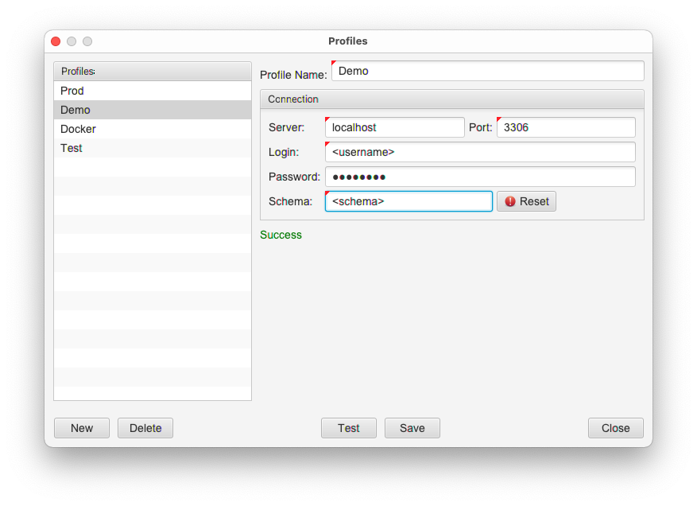

# Setup Database

1. Create schema

```shell
mysql> create schema <schema> character set = utf8;
```

2. Create user

```shell
mysql> create user <username> identified by '<password>';
```

3. Grant privileges

```shell
mysql> grant alter,create,delete,drop,insert,references,select,update on <schema>.* to <username>;
```

4. Create connection profile using schema and user setup



